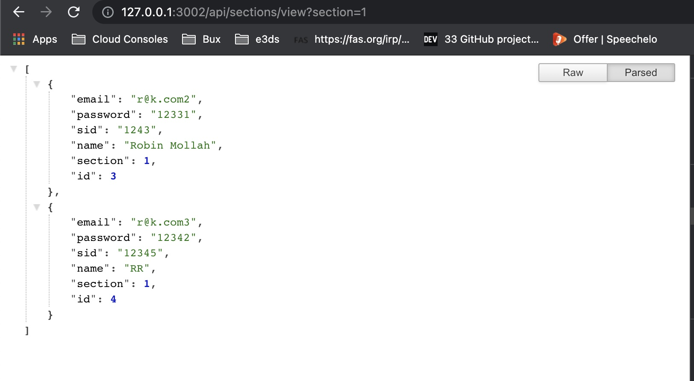

## This was a short assignment of CSE310 course


## Environment
- [NodeJS](https://nodejs.org/en/download/) v12.18.4

## Build instruction

Edit the `.env` file with your MySQL server's values.

Run the following code:

```
npm install
npm run migration
npm start
```

## Database Design

`17201010_users` {sid, id, section#foreign, name, email}
`17201010_courses` {name, time, seats, id}

## Default faculty login
username: admin<br/>
password: admin

## Screenshots





